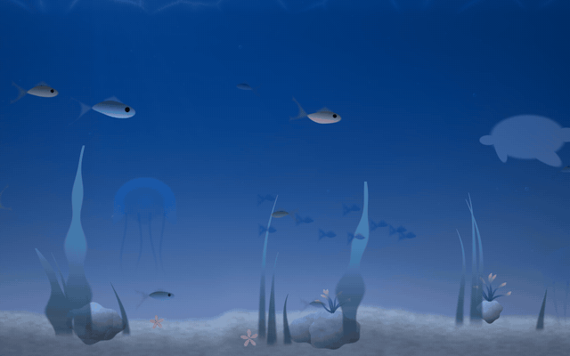
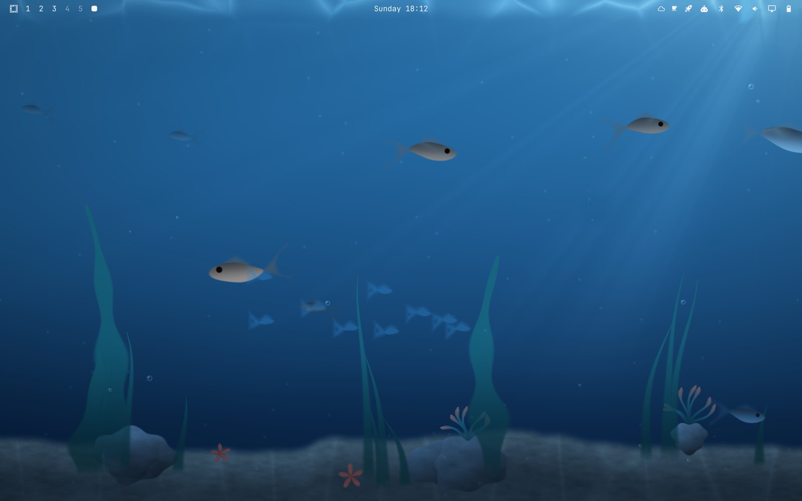

# Macarchy

**The macOS experience for [Omarchy](https://omarchy.org) on Apple Silicon.**



A MacBook running Omarchy on [Asahi Linux](https://asahilinux.org) deserves to
feel like the machine it was built to be. These repos make that happen —
independent community work, not affiliated with the Omarchy project.

## Quick start

One command, from a fresh Omarchy-on-Asahi install to the desktop: the
macarchy-core suite, the Touch Bar, the aquarium and both apple-glass themes.

```sh
curl -fsSL https://raw.githubusercontent.com/macarchy/macarchy-install/main/boot.sh | bash
```

It clones those five repos, runs the macarchy-core and macarchy-touchbar installers,
builds and installs the aquarium, syncs the two themes into
`~/.config/omarchy/themes`, appends the Hyprland autostarts and binds once, and
skips whatever is already done, so re-running it is also how you update.
`./doctor.sh` in that repo is the read-only answer to *"is any of this actually
running?"*. `omarchy-aikit` and `jarvis` are not part of it; each installs
itself from its own repo.

Or take one piece at a time:

```sh
# the themes
omarchy-theme-install https://github.com/macarchy/apple-glass
omarchy-theme-install https://github.com/macarchy/apple-glass-light

# the suite (--udev also lays down the battery-limit rule and trackpad quirks)
git clone https://github.com/macarchy/macarchy-core && macarchy-core/install.sh --udev
# it wires the Cmd keys and Cmd+Tab only; copy the dock, auto-brightness, pinch
# and Ctrl+scroll zoom lines from macarchy-core/hypr/example.lua yourself

# the aquarium
git clone https://github.com/macarchy/omarchy-aquarium && omarchy-aquarium/install.sh

# the Touch Bar
git clone https://github.com/macarchy/macarchy-touchbar && macarchy-touchbar/install.sh
```

## The suite

Not all of it is about Apple hardware. The aquarium runs on any Hyprland
desktop, Jarvis on any Linux box with a microphone, and the Touch Bar daemon
wants the hardware but not Omarchy — it reads Hyprland directly.

### Needs a MacBook

| Repo | What it is |
| --- | --- |
| [macarchy-install](https://github.com/macarchy/macarchy-install) | The one-command installer, and the place to start if you want the desktop in one go: it clones five of the repos below — macarchy-core, macarchy-touchbar, omarchy-aquarium and the two apple-glass themes — installs each, appends the Hyprland wiring once, and leaves your local edits alone. Ships a `doctor.sh` health check. It does not touch `omarchy-aikit` or `jarvis`: those two install themselves. |
| [macarchy-core](https://github.com/macarchy/macarchy-core) | The core suite, for anyone who misses macOS's reflexes on a MacBook running Linux: ambient-light **auto brightness**, an 80% **battery charge limit**, a macOS-style **dock**, four-finger **pinch gestures**, a `Ctrl`+scroll screen **magnifier**, the full **Cmd-key vocabulary**, a **Cmd+Tab** switcher, scheduled light/dark **appearance**, and GTK theme sync. |
| [macarchy-touchbar](https://github.com/macarchy/macarchy-touchbar) | The **Touch Bar**, drawn by us — a Python daemon that owns the panel over DRM and its touch surface over evdev instead of settling for a function-key strip. Layouts follow the focused window; widgets, groups and scenes come from modules you can write. For Touch Bar MacBook owners on Linux, with or without Omarchy. |

### Needs Omarchy, not a Mac

| Repo | What it is |
| --- | --- |
| [apple-glass](https://github.com/macarchy/apple-glass) | The dark glass theme: translucent blur and vibrancy, tuned against the aquarium. For any Omarchy desktop. |
| [apple-glass-light](https://github.com/macarchy/apple-glass-light) | Its daylight counterpart — the two switch on a schedule, like macOS's Auto appearance. |
| [omarchy-aikit](https://github.com/macarchy/omarchy-aikit) | Your backlog, one keystroke from the bar: pick a repository, pick an [AI Migration Kit](https://github.com/phmatray/ai-migration-kit) skill for Claude Code, and the session starts in tmux. A cross-repo work queue answers *"what should I work on?"*, and the menus read a local SQLite mirror, so none of them ever waits on the network. For anyone running Claude Code across more repositories than they can hold in their head. |



### Needs neither

| Repo | What it is |
| --- | --- |
| [omarchy-aquarium](https://github.com/macarchy/omarchy-aquarium) | A living underwater scene as your desktop background — water, caustics, sand, weed, bubbles and fish are one GLSL fragment shader on a Wayland layer surface, with no video, no image and no scene graph. Runs on Hyprland; the README doubles as field notes on profiling Apple GPUs. |
| [jarvis](https://github.com/macarchy/jarvis) | A bilingual (FR/EN) voice assistant that fits in one bash file, with Claude as its brain, the shell as its hands and a pixel-art Babel fish as its face. The voice loop is portable to any Linux box with PipeWire and a microphone; the desktop hands and the face want Omarchy, and say so. |

## Naming

The prefix records what a repo was built for — not a promise about the only
place it runs:

- **`macarchy-*`** — needs Apple hardware. `macarchy-core`,
  `macarchy-touchbar`, `macarchy-install`.
- **`omarchy-*`** — built for the Omarchy desktop, which is where it is
  installed and supported. `omarchy-aikit`, `omarchy-aquarium` — the aquarium
  also runs on any wlroots compositor.
- **no prefix** — named for what it is rather than what it needs.
  `apple-glass` and `apple-glass-light` are Omarchy themes; `jarvis` wants only
  a Linux box with a microphone.

Names do change when they turn out to be wrong: on 2026-09-04 `omarchy-mac`
became `macarchy-core`, because it collided with the unrelated upstream distro
of that name, and `macarchy-dfr` became `macarchy-touchbar`, because "DFR" is
jargon.

The installed commands moved to `macarchy-*` in the same pass. That takes them
out of the namespace upstream Omarchy expands into, so an upstream command can
no longer shadow one of ours through PATH order.

Built and tuned on a MacBook Pro (13-inch, M2) — issues and reports from other
Apple Silicon machines are very welcome.
